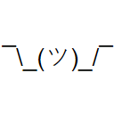

# Try [](https://github.com/StephenCleary/Try/actions?query=workflow%3ABuild) [](https://codecov.io/gh/StephenCleary/Try) [](https://www.nuget.org/packages/Nito.Try) [](https://www.fuget.org/packages/Nito.Try)

 he Try monad (Error/Exceptional monad) for C#, particularly useful for railroad programming, [e.g., with TPL Dataflow](https://github.com/StephenCleary/Try/blob/fb28ba54651a220faea3f7acf1455531d782724d/test/UnitTests/Examples/DataflowExample.cs).

[](https://docs.microsoft.com/en-us/dotnet/standard/net-standard) [](https://docs.microsoft.com/en-us/dotnet/standard/net-standard)

## The Try Monad

`Try<T>` is a simple kind of wrapper monad that represents either a value or an exception.

The API for this monad is not fully "pure". In particular, `Try<T>` is not lazy in any way; it represents an exception or value that is already known. The `Try<T>` type also has several helpers that make it more C#-friendly and less purely functional.

## Wrapping

The standard way to wrap a value or exception is via `Try.Create`. `Try.Create` takes a delegate, which is executed immediately. If the delegate throws an exception, the resulting `Try<T>` is a wrapper for that exception; if the delegate successfully returns a result, the resulting `Try<T>` is a wrapper for that result value.

```C#
Try<int> t = Try.Create(() =>
{
  MethodThatMayThrow();
  return 13;
});
```

If you have a value or exception that you want to wrap directly, you can call `Try.FromValue` or `Try.FromException<T>` directly rather than using a delegate with `Try.Create`:

```C#
Try<int> t1 = Try.FromValue(13);
Try<int> t2 = Try.FromException<int>(new InvalidOperationException());
```

## Working with Try<T> Instances

You can transform one wrapped value into another wrapped value by calling `Try<T>.Map` and passing it a delegate to do the transformation. If the current `Try<T>` instance is an exception, then `Map` immediately returns another wrapper for that exception; otherwise, `Map` executes its delegate and returns a `Try<T>` that is either a value or exception, depending on whether the `Map` delegate throws.

```C#
Try<int> t1 = ...;
Try<int> t2 = t1.Map(value => checked(value * 2));
```

The normal monad-like APIs such as `Bind`, `Select`, and `SelectMany` are also available. The latter two allow LINQ syntax:

```C#
Try<int> t1 = ...;
Try<int> t2 = ...;
Try<int> t3 = from v1 in t1
              from v2 in t2
              select v1 + v2;
```

## Unwrapping

There are a variety of ways to extract the value or exception when you are ready to be done with the `Try<T>` type. The most straightforward is `Try<T>.Value`, which raises the exception if the instance is an exception, and returns the value otherwise.

```C#
Try<int> t1 = ...;
int v1 = t1.Value; // throws if t1 wraps an exception
```

You can also use the `IsException`, `IsValue`, and `Exception` properties to determine if it's safe to access the `Value` property.

```C#
Try<int> t1 = ...;
if (t1.IsValue)
    Console.WriteLine(t1.Value);
```

```C#
Try<int> t1 = ...;
if (t1.IsException)
    Console.WriteLine(t1.Exception);
```

```C#
Try<int> t1 = ...;
if (t1.Exception != null)
    Console.WriteLine(t1.Exception);
```

Finally, you can use deconstruction to get the exception and value simultaneously.

```C#
Try<int> t1 = ...;
var (exception, value) = t1; // Does not throw, even if t1 wraps an exception.
// if `exception` is `null`, then `value` is a valid value.
```

A more "functional" or "monadic" way of processing results is the `Match` method, which always runs one of its delegate arguments and not the other.

```C#
Try<int> t1 = ...;
string result = t1.Match(
    exception =>
    {
        Console.WriteLine(exception);
        return "error";
    },
    value =>
    {
        Console.WriteLine(value);
        return "ok";
    }
);
```

### Don't Unwrap-Then-Wrap

Don't write code that unwraps `Try<T>` values if they just end up being wrapped again. E.g., this is an antipattern:

```C#
// BAD CODE! Do not do this!
Try<int> t1 = ...;
Try<int> t2 = Try.Create(() =>
{
    return t1.Value + 10;
});
```

In this case, if `t1` is an exception, that exception will get raised at `t1.Value` and then captured by `Try.Create`. The semantics are correct, but this code pattern adds a new call stack to the exception, since it was thrown again. This can make debugging more complex.

Instead of unwrapping and wrapping again, use `Map`:

```C#
// Same semantics as above, but better behavior with exceptions
Try<int> t1 = ...;
Try<int> t2 = t1.Map(v1 =>
{
    return v1.Value + 10;
});
```

### Short Circuit failure paths

A powerful way of using this monad is by combining `Map()` and `Bind()`. Aside from making the code more fluent, the execution path will short circuit and return as soon as a failure state is encountered:

```C#
Try<int> tryResult = Increment1(1)
   .Bind(Increment2)
   .Map(Increment3);

string result = tryResult.Match(
   exception => $"Failed: {exception.Message}",
   value => $"Passed: {value}");

private static Try<int> Increment1(int x)
{
   return Try.Create(() => x + 1);
}

private static Try<int> Increment2(int x)
{
   return Try.FromException<int>(new Exception("Failed!"));
}

// This method will never get executed since the previous method threw an exception
private static int Increment3(int x)
{
   return x + 3;
}
```